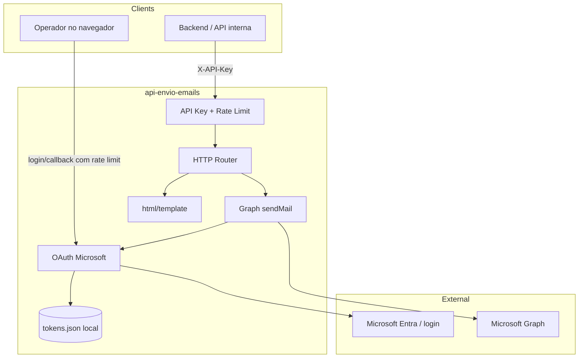
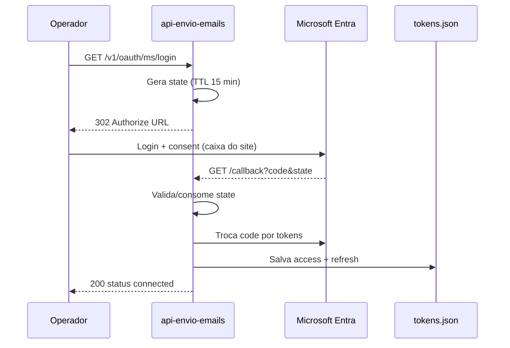
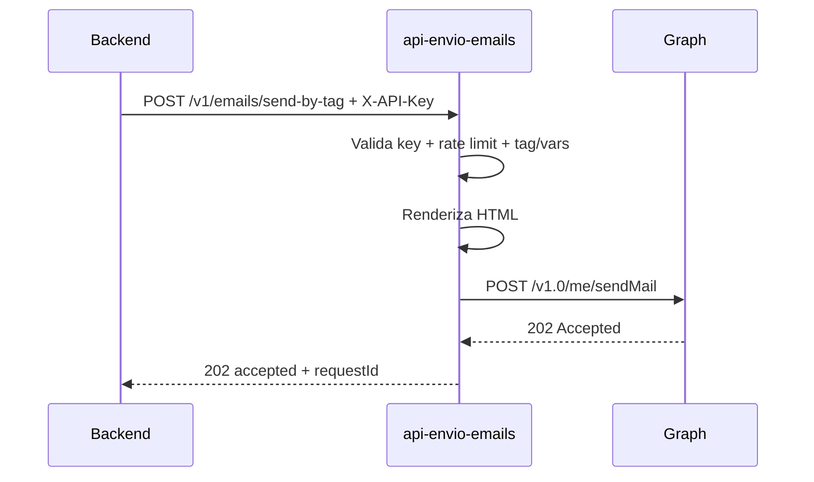

# Arquitetura — api-envio-emails

## Visão geral

Serviço HTTP em Go (somente stdlib) que envia e-mails pela caixa Outlook do site via Microsoft Graph. OAuth é feito **uma vez pelo operador**; backends autenticam com API key.

**Deploy OAuth:** exponha `/v1/oauth/ms/login` e `/callback` apenas em localhost, VPN ou túnel autenticado. Em produção pública, o risco é takeover da caixa do site. Rate limit: **10 req/min** por IP nessas rotas.
## Camadas

| Pacote | Papel |
|--------|--------|
| `cmd/server` | Bootstrap, timeouts, security headers, logging |
| `internal/config` | Carrega env / `.env` opcional; valida `API_KEY` |
| `internal/httpapi` | Rotas, handlers, middleware |
| `internal/auth/msgraph` | Authorize, exchange, refresh, state CSRF |
| `internal/mail` | `sendMail` + leitura de perfil do remetente |
| `internal/templates` | Catálogo de tags + renderização HTML |
| `internal/store` | Persistência JSON dos tokens OAuth |

## Fluxo OAuth (operador)

- Scopes padrão: `Mail.Send`, `User.Read`, `offline_access`, `openid`, `profile`.
- Access token é renovado via refresh quando próximo do vencimento.
- `invalid_grant` → status `needs_reauth` (operador precisa logar de novo).

## Envio de e-mail

`202` = aceito pelo Graph para envio; não garante entrega na caixa do destinatário.

## Microsoft Entra

1. [Entra admin center](https://entra.microsoft.com) → **App registrations** → **New registration**.
2. Contas: **Personal Microsoft accounts only** (ou misto, se necessário).
3. Anote o **Application (client) ID**.
4. **Authentication** → plataforma **Web** → Redirect URI igual a `MS_REDIRECT_URI`.
5. **Certificates & secrets** → novo client secret (copie o Value uma vez).
6. **API permissions** → Microsoft Graph → **Delegated**: `Mail.Send`, `User.Read`.
7. Preencha `.env` a partir de `.env.example`.

Em produção, cadastre a Redirect URI pública HTTPS correspondente ao serviço (sem publicar URLs internas de rede privada).

## Segurança

| Controle | Comportamento |
|----------|----------------|
| API key | `X-API-Key` ou `Authorization: Bearer`; comparação em tempo constante |
| Validação no boot | Falha se `API_KEY` vazia, curta (&lt; 24) ou valor fraco conhecido |
| Rate limit | 60 req/min por IP nos endpoints com API key; **10 req/min** em OAuth login/callback (`429` + `Retry-After`) |
| `TRUST_PROXY_HEADERS` | Se `true`, usa `X-Forwarded-For` no rate limit (só atrás de proxy que sanitiza o header) |
| Headers | `nosniff`, `X-Frame-Options: DENY`, `Referrer-Policy: no-referrer`, HSTS |
| OAuth state | Aleatório, TTL 15 min, uso único |
| Token file | Escrito com permissão `0600` |
| JSON | `DisallowUnknownFields` + limite **1 MiB** (`413` se exceder) |
| Destinatários | `net/mail.ParseAddress` em `to`/`cc`; máx. 50 por campo |
| HTML | `htmlBody` cru **rejeitado**; exige `template` ou rotas por tag/tipo |

### Dados sensíveis (não publicar)

- `API_KEY`, `MS_CLIENT_SECRET`
- Conteúdo de `TOKEN_STORE_PATH` (refresh/access tokens)
- Segredos de deploy / variáveis de ambiente de produção
- E-mails pessoais reais em docs/issues

## Configuração

Ver tabela no [README](../README.md#configuração) e o template [`.env.example`](../.env.example).

## Referência de API

Ver [api.md](./api.md).
